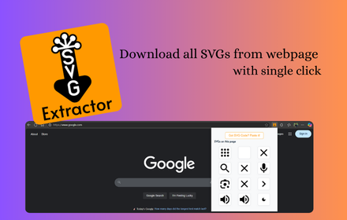

# SVG Extractor

**SVG Extractor** is a lightweight and easy-to-use browser extension that lets you extract, preview, and download all SVG images from any webpage. Whether you're a developer, designer, or just exploring vector graphics online, this tool helps you grab SVGs quickly and efficiently.

---

## 🌟 Features

- 🔍 Automatically detects and displays all SVGs on the current webpage
- 👆 Click any SVG to preview it in full size
- 📥 Download SVGs in **SVG**, **PNG**, and **JPG** formats
- 🧪 "Try pasting that SVG here" option to manually preview and download SVG code
- 🎯 Simple, fast, and privacy-friendly (no tracking or analytics)

---

## 📷 Screenshots

---

## 💻 Installation (Manual)

You can also load the extension manually in your browser:

1. Clone or download this repository.
2. Open your browser's extensions page.
3. Enable "Developer Mode".
4. Click **Load unpacked** and select the project folder.

---

## 📬 Support

If you encounter any issues or have suggestions, feel free to open an [issue](https://github.com/yourusername/svg-extractor/issues) or submit a pull request.

---
